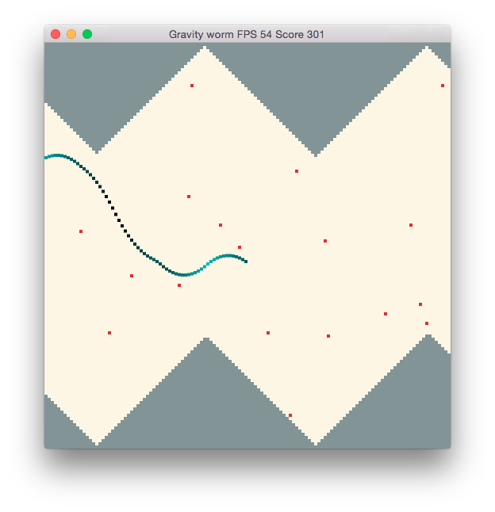

rust-gravity-worm-ii [](https://travis-ci.org/alexchandel/rust-gravity-worm-ii)
====================

A Gravity Worm clone written in Rust, using the Piston game engine. This is my first experiment with Piston, so there are a few issues. Notably, there's no text in the user interface!



## Building Instructions
I build against rust nightlies. Give me a shout (submit an issue) if it doesn't build and I'll fix it ASAP.

Currently the only non-rust dependency is SDL2. You can install it via your system's package manager:

Ubuntu/Debian: sudo apt-get install libsdl2-dev
Mac OS: brew install sdl2
Windows: echo "?"

In a terminal, navigate to the project directory and type:
```
cargo run --release
```

## License
Licensed under the GPL v3.
